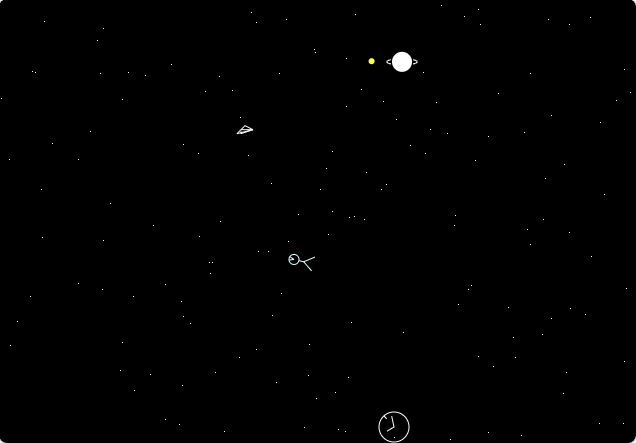

# Starman Web Port

This project is a port of an old MS-DOS screensaver, originally written in Turbo C++, to a modern web-based version using HTML, CSS, and JavaScript.

The primary goal was to explore the capabilities of Large Language Models (LLMs) in assisting with the code translation and adaptation process from a legacy language and environment (Turbo C++/MS-DOS graphics) to a current web stack.

## Original Source

The original Turbo C++ source code can be found in the `original-src` directory.

## Web Version

The ported web version is located in the `web` directory. Open `web/index.html` in a browser to run the screensaver.

## Controls (Web Version)

-   **F**: Toggle Firefly Mode (makes stars race randomly)
-   **Space**: Make Stars Fall
-   **R**: Make Stars Race
-   **C**: Toggle Clock visibility

## Screenshot

