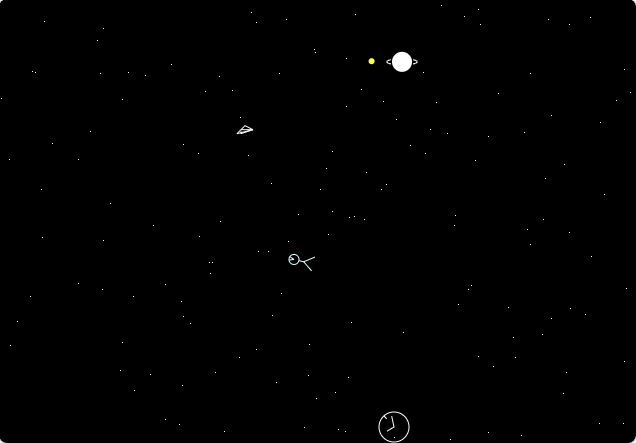
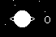
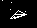
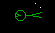

# Starman Web Port

This project ports an MS‑DOS screensaver written in Turbo C++ to a modern web version using HTML, CSS, and JavaScript.  
The primary goal is to explore how Large Language Models (LLMs) can assist in translating and adapting legacy Turbo C++/MS‑DOS graphics code for today’s web stack.

## Original Source

The original MS-DOS Turbo C++ source code (Dec 1991) can be found in the `original-src` directory.

## Web Version

The ported web version is located in the `web` directory. Open `web/index.html` in a browser to run the screensaver.

## Controls (Web Version)

- **F**: Toggle Firefly mode, making stars dart with random direction changes.  
- **Space**: Make stars fall and accumulate at the bottom row.  
- **R**: Make stars race in straight lines without direction changes.  
- **C**: Toggle the clock display.

When the clock hits a screen edge, it rotates around the contact point for three seconds. If it bounces off a corner, it rotates along both axes—creating a “shrink-and-grow” effect—then redraws its hands.

## Screenshots

### Web Version

### MS‑DOS Emulator

